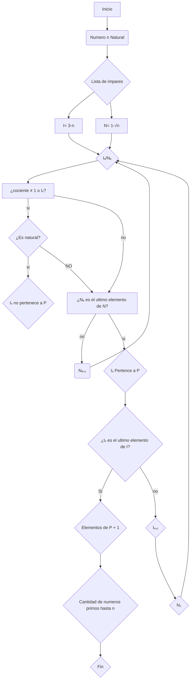

# Reto 3: Números Primos y Raices

## Logo del team:
***

 [](https://postimg.cc/9D2jMgwD)

## En este repositorio estan los algoritmos para:
1. Algoritmo para saber la cantidad de números primos hasta un número natural n en..
  - Pseudocodigo
  - Diagrama de Flujo 
2. Algoritmo para sacar raiz cuadrada a un número n en...
	 
  - Pseudocodigo
   - Diagrama de Flujo   

## 

Plantear el algoritmo para obtener los números primos hasta un valor dado **n**. Para ello:

## Algoritmo 
### (Diagrama de Flujo)

### (Pseudocódigo)
```pseudocode
n : numero ℕ cualquieraa
I : Impares [3,n]
N : Impares [1,√n]
M : (Iₓ/Nₑ)
 Inicio
   Para n entonces
    Para (Iₓ,Nₑ) hacer
     M 
     si M ∈ ℕ ; M ≠ 1 ; M ≠ Iₓ
      entonces Iₓ ∉ P
     Si no si  M = 1 o M = Iₓ
      entonces
         Si Nₑ es el ultimo elemento de N
           entonces Iₓ ∈ P
             si Iₓ es el ultimo elemento de I
             entonces
             z : "Elementos de P" + 1 
             escribir (" hay z numeros primos hasta n ")
             si no  
             (Iₓ₊₁/N₁)
             entonces 
             M
             Fin Si
         si no
             entonces Nₑ₊₁
             M
         Fin Si
     Fin Si
    Fin Para
   Fin Para
 Fin
```
## 

Plantear el algoritmo para conocer la raiz de un numero n natural
## Algoritmo 
### (Diagrama de Flujo)


### (Pseudocódigo)
  #### no me alcanzó :´(

